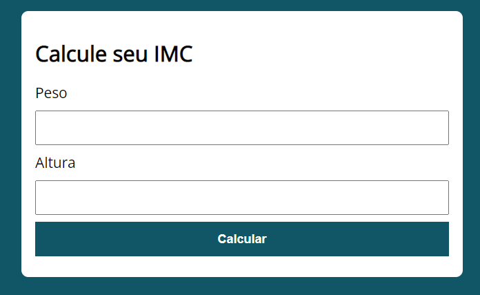
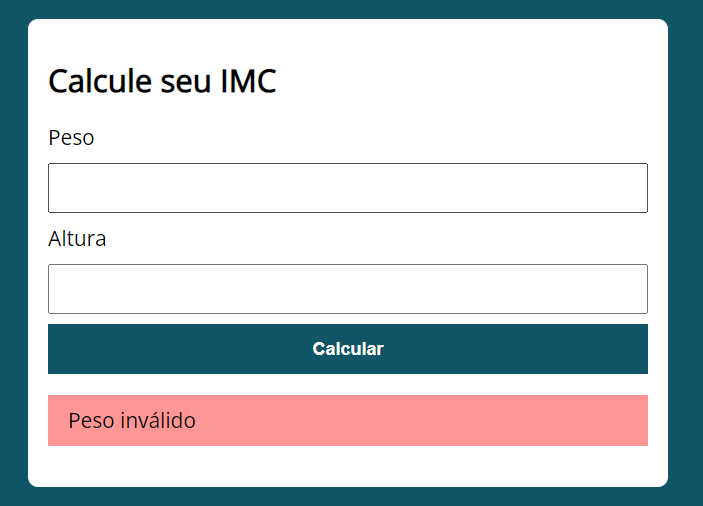
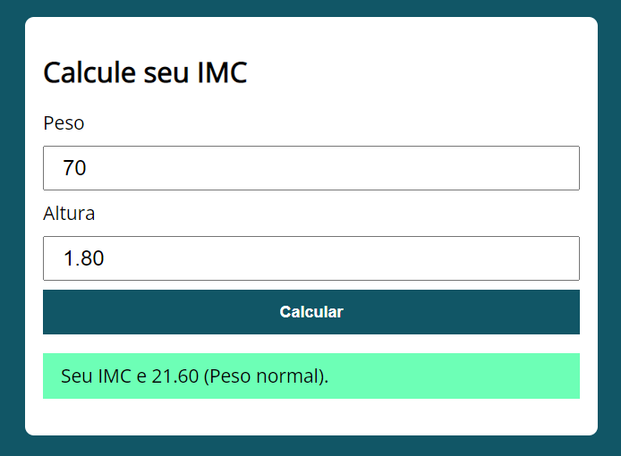

# 🏋️ Calculadora de IMC

Projeto desenvolvido durante o curso **"JavaScript e TypeScript do básico ao avançado JS/TS"** da Udemy, ministrado por Luiz Otávio Miranda.  
O objetivo é criar uma aplicação simples para calcular o **Índice de Massa Corporal (IMC)** de um usuário.

---

## 🚀 Funcionalidades

- Entrada de **peso** e **altura** pelo usuário  
- Cálculo automático do **IMC**  
- Exibição da classificação de acordo com a tabela da OMS:  
  - Abaixo do peso  
  - Peso normal  
  - Sobrepeso  
  - Obesidade grau 1, 2 ou 3  

---

## 🛠️ Tecnologias Utilizadas

- **HTML5** para estrutura  
- **CSS3** para estilização  
- **JavaScript (ES6+)** para a lógica da aplicação  

---

## Interface
<p align="center">
   
</p>

<p align="center">
   
</p>

<p align="center">
   
</p>


## Como executar
1. Clone o repositório
  ```bash
  git clone https://github.com/JsnEvt/IMC.git
  ```

2. Acesse a psata
  ```bash
  cd IMC
  ```
   
3. Abra o arquivo index.html

## Licença
Projeto para fins educacionais


